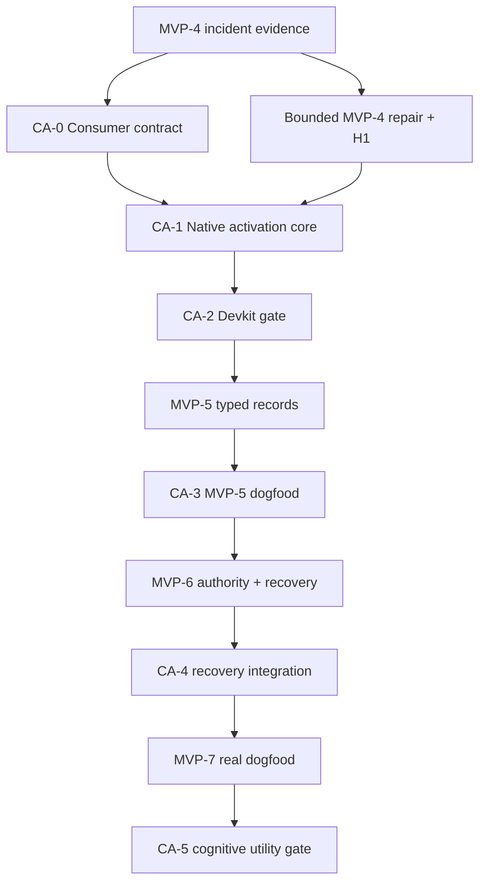

# Qiven Runtime Production MVP Roadmap Amendment

## Adding Task Cognition Activation Without Replacing the Control MVP

> **Status:** Proposed roadmap amendment  
> **Date:** 2026-09-23  
> **Amends:** `qiven-runtime/docs/architecture/runtime-production-mvp-architecture.md`  
> **Does not supersede:** the original MVP-0 through MVP-7 architecture or its complete-mediation claim  
> **Governance:** `00-qiven-cognitive-governance-program.md`  
> **Architecture:** `01-qiven-task-cognition-activation-architecture.md`  
> **Acceptance:** `02-qiven-cognitive-effectiveness-acceptance.md`

## 0. Amendment Decision

The original Runtime production MVP remains the authoritative vertical plan for one explicit actor, operation class, and governed resource scope. Its sequence and claims SHALL NOT be renamed or silently reinterpreted.

Qiven SHALL add a horizontal **Task Cognition Activation** track with gates `CA-0` through `CA-5`. The track closes a different control gap:

```text
Original Runtime MVP
    Governs whether and how an external action may execute.

Task Cognition Activation
    Governs which project cognition must be present before a participant
    specifies, designs, implements, reviews, or accepts that action path.
```

The two tracks converge at MVP-7, but their evidence remains separate.

The immediate sequencing decision is:

> Freeze substantive MVP-5 work. Start CA-0 immediately from the MVP-4 evidence while a strictly bounded MVP-4 corrective lane uses an explicit incident pack and independent falsification to rerun the original real H1 gate. CA-1 begins only after both CA-0 and MVP-4 H1 pass. Qiven then completes CA-1 and CA-2 before substantive MVP-5 implementation resumes. MVP-5 and MVP-6 dogfood the accepted activation path. MVP-7 requires both the original Runtime Control Gate and the new Cognitive Utility Gate.

This pause is bounded. It is not a rewrite of Runtime, Context, Devkit, or Foundation, and it SHALL NOT revive the approximately 300-second Python Context compiler/gate.

---

## 1. Why This Is an Amendment, Not MVP-4.1

The failures observed during the MVP-4 owner H1 sequence include at least two different classes:

- an external payload contract was assumed incorrectly;
- a non-owning C++ byte view outlived its temporary backing storage.

Those are not merely local hook bugs. Existing project cognition already contained relevant engineering laws, yet they were not reliably active before implementation and self-validation. The same authoring context could then reproduce its assumptions in code and tests until H1 supplied the first independent reality check.

Changing only the hook adapter would repair the instances while preserving the producing mechanism. Changing Foundation to own every repeated noun would move domain semantics downward without guaranteeing task-time discovery. Adding more prose to cold boot would increase attention competition.

Therefore:

- MVP-4 fixes remain local to their correct semantic owners;
- the recurring cognition-delivery gap receives its own cross-cutting program;
- existing MVP numbers keep their original meaning;
- every later Runtime MVP becomes a real consumer of the new path.

---

## 2. Baseline and Status Interpretation

The original architecture defines completion by exit evidence, not by code merge. Under that law, the program baseline is:

| Track | Current governance interpretation |
|---|---|
| MVP-0 | Completed under existing evidence |
| MVP-1 | Completed under existing evidence |
| MVP-2 | Completed under existing evidence |
| MVP-3 | Completed under existing evidence |
| MVP-4 | Implementation exists, but the batch is **not accepted** while the real H1 exit gate has failed or remains unrepeated after correction |
| MVP-5 | Not authorized for substantive implementation until CA-0 through CA-2 pass |
| MVP-6 | Follows MVP-5 and must include activation recovery integration |
| MVP-7 | Requires original seven-day/20-transaction gate plus CA-5 |

This amendment does not retroactively invalidate valid MVP-0 through MVP-3 evidence. It classifies the MVP-4 events as an upstream governance signal and introduces controls before the next large semantic batch.

---

## 3. Integrated Program Topology



CA-3 and CA-4 are not detached projects completed after their matching MVPs. They are exit dimensions of the matching batches. The diagram shows evidence dependency, not permission to defer cognition integration until implementation is finished.

The bounded MVP-4 lane may correct only the already identified hook-adapter and acceptance defects. It receives a manually curated, digested incident pack containing the applicable lifetime, payload-contract, IPC, and H1 rules plus independent review. It may not introduce new feature breadth or proceed to MVP-5. This temporary pack is evidence for CA-0, not a competing activation architecture.

---

## 4. The CA-0 Through CA-5 Sequence

### CA-0 — Consumer Contract and Causal Baseline

#### Objective

Define what the LLM consumer needs at each engineering boundary and establish a measurable baseline before building retrieval.

#### Work

- accept the distinction among Project Continuity, Activation Correctness, Cognitive Utility, and Mechanical Governance;
- accept risk classes R0 through R3 and the phase vocabulary;
- define `qiven-engineering-task-v1` without encoding one model's prompt habits;
- define protected cognition, candidate cognition, unresolved applicability, and semantic-owner discovery;
- inventory canonical source categories and ownership by repository;
- map the MVP-4 failures to incident scars and sealed acceptance fixtures;
- measure the actual current cold-boot corpus, task-specific additions, time-to-first-design, and first-pass quality;
- seal the initial gold fixture corpus and scoring rubric;
- record the old Python compiler/retrieval system as sealed historical input, not a component to restore;
- propose the root ADR and non-terminal obligation that authorize the TCA program.

#### Repository changes

| Repository | CA-0 delta |
|---|---|
| `qiven-context` | ADR/obligation, scar classification, canonical source inventory, initial activation metadata schema |
| `qiven-devkit` | Task/risk taxonomy and acceptance workflow drafts |
| `qiven-foundation` | Public capability-surface inventory; no speculative new primitives |
| `qiven-runtime` | Architecture and port-level contract only; no broad implementation |

#### Exit gate

- all four claims have independent acceptance statements;
- six or more sealed fixtures cover the known critical boundary classes;
- current cold-boot cost and outcome baseline are reproducible;
- every initial protected rule has one canonical owner and exact source reference;
- no design assumes that more prompt volume equals better attention;
- the program has explicit non-goals and a rollback boundary.

### CA-1 — Native Deterministic Activation Core

#### Objective

Build the smallest native, local, explainable path that maps a pinned RuntimeGeneration and task descriptor to an immutable task bundle and receipt.

#### Work

- implement task normalization and observed-versus-claimed provenance;
- validate `runtime/cognition-core.yaml` and `runtime/cognition-activation-policy.yaml`;
- ingest exact pinned Git/tree sources already admitted by the Runtime cognition publisher;
- build an immutable, rebuildable activation index outside canonical truth;
- evaluate P0/P1 protected rules without ranking;
- resolve repository semantic-owner and capability entries;
- rank only optional P3/P4 candidates using deterministic local signals;
- construct and atomically publish `TaskCognitionBundle`;
- issue, persist, explain, invalidate, and verify `ContextActivationReceipt`;
- implement bounded one-shot native commands over the same core used by the future resident service;
- add conformance, determinism, budget-pressure, corruption, and crash tests.

#### Explicit exclusions

- no Python production dependency;
- no LLM call, embedding service, vector database, or network query;
- no generative summarization;
- no K5 compression;
- no expansion of the Runtime complete-mediation resource scope;
- no mutation of canonical Context through the activation query path.

#### Exit gate

- Profile A and Profile B of the acceptance protocol pass;
- protected applicability recall is 100% on sealed fixtures;
- byte-identical inputs produce byte-identical canonical outputs;
- source, policy, generation, task, design, and live-evidence changes invalidate receipts correctly;
- cold index rebuild is below 5 seconds and warm task activation p95 is below 250 milliseconds on the reference corpus;
- canonical Context mutation does not wait for task bundle generation;
- loss/corruption of the activation index is recovered from pinned canonical sources.

### CA-2 — Devkit Preflight and Independent Falsification Gate

#### Objective

Make activation an ordinary engineering boundary rather than an optional command that a participant remembers to invoke.

#### Work

- add `qiven cognition prepare`, `show`, `explain`, and `verify-receipt` workflow surfaces;
- observe repository, task phase, changed paths, language, platform, and boundary kinds where mechanically possible;
- require a valid receipt before R2/R3 design, implementation publication, and review;
- add the cognition compliance map to engineering design evidence;
- define `qiven-cognitive-falsification-receipt-v1`;
- add fresh-context adversarial review for required R2/R3 risks;
- ensure material design or task changes trigger reactivation;
- make missing/stale/unresolved receipts fail visibly without granting new execution authority;
- keep the current manual boot path available in shadow mode.

#### Exit gate

- an R2/R3 candidate cannot pass the Devkit publication gate without valid activation and falsification receipts;
- bypass, replay, stale generation, stale design, and policy-change cases are tested;
- independent review finds planted ownership, payload, concurrency, and recovery defects in the acceptance corpus;
- same-session tests alone are rejected as the sole evidence for the declared high-risk classes;
- routine preflight meets the operational budgets;
- the operator can explain every protected inclusion and every evaluated protected exclusion.

### CA-3 — MVP-5 Typed-Record Dogfood

#### Objective

Use the typed-record and Git candidate transaction batch as the first full production task consumer of TCA.

#### Work

- activate record-domain, representation, Git-CAS, filesystem-transaction, ownership, validator, and external-tool cognition before design and implementation tasks;
- bind task receipts to design digests and candidate revisions;
- publish a new activation index only after an MVP-5 canonical commit succeeds and a complete new cognition generation validates;
- keep activation-index publication outside the typed record's atomic canonical Git transaction;
- surface the correct existing capability owner before creating new renderers, path types, hashes, results, or byte abstractions;
- independently falsify request idempotency, temporary-index isolation, ref CAS, working-tree projection, and validator assumptions;
- record defects by discovery surface: author, independent review, CI/fault test, or H1.

#### Integration law

The MVP-5 transaction owns canonical record mutation. It does not make the derived activation index part of canonical truth:

```text
typed record request
    -> validate candidate tree
    -> commit + local-ref CAS
    -> publish canonical success
    -> build/validate new cognition generation
    -> atomically activate derived index
```

If the final two steps fail, the canonical commit remains valid and the prior cognition generation remains active. The new generation reports `NotActivated`; it is never partially visible.

#### Additional MVP-5 exit evidence

In addition to every original MVP-5 exit criterion:

- every R2/R3 work unit has valid bound receipts;
- all four initial record families produce the expected activation-generation transition;
- a failed validator creates neither a canonical commit nor a new active activation index;
- a successful canonical commit followed by index-build failure preserves the last good active generation and reports the lag explicitly;
- replay/idempotency behavior cannot issue a misleading new cognition generation;
- no critical accepted scar recurs before independent review;
- CA-3 dogfood evidence is complete enough for Profile E.

### CA-4 — MVP-6 Authority and Recovery Integration

#### Objective

Extend end-to-end recovery semantics to the derived cognition generation, receipt lifecycle, and task-bundle cache without confusing them with canonical action truth.

#### Work

- journal only activation control facts: generation identity, build outcome, active pointer transition, receipt issuance/staleness, and barriers;
- keep index bodies and task bundles as external rebuildable derivatives;
- reconcile a crash before index publication, after publication but before pointer activation, and after activation but before acknowledgement;
- invalidate old unconsumed task receipts after relevant generation/policy changes;
- prove that receipt invalidation does not resurrect a consumed execution decision;
- fence concurrent cognition publishers so only one active generation transition wins;
- preserve exact task-cache keys; forbid approximate receipt reuse;
- add a cognition-readiness barrier when a required new canonical generation cannot be activated safely;
- keep an already accepted previous generation available for tasks whose exact inputs remain compatible;
- exercise cold rebuild, corruption, partial publication, stale live evidence, shutdown, and restart.

#### Additional MVP-6 exit evidence

In addition to every original MVP-6 exit criterion:

- two RuntimeHost instances cannot publish competing active cognition generations;
- an interrupted generation build never exposes a partial index or bundle;
- recovery classifies generation publication as succeeded, not performed, stale, or conflicting without blind replay;
- stale receipts fail closed for their governed engineering gate;
- loss of derivative artifacts rebuilds without changing canonical Git truth;
- no recovery path calls the retired Python compiler or a remote cognition service;
- the original action reconciliation and fencing guarantees remain unchanged.

### CA-5 — MVP-7 Cognitive Utility Gate

#### Objective

Prove, separately from action enforcement, that Qiven's external cognition measurably improves its LLM consumer during real engineering work.

#### Work

- run the full paired fresh-consumer protocol on the sealed corpus;
- finish MVP-5/MVP-6 dogfood and recurrence analysis;
- measure active input volume, activation latency, reasoning quality, critical misses, semantic-owner discovery, and time to reviewable design;
- classify all owner-live/H1 findings as known-hazard escapes or genuinely new external evidence;
- prove manual-path rollback;
- produce a prompt-retirement map without deleting canonical history;
- publish distinct Control Gate and Cognitive Utility Gate evidence packages.

#### Cognitive Utility release gate

All Profile C, D, and E criteria in the acceptance protocol pass, including:

- zero protected misses;
- zero critical misses in activated fresh-consumer runs;
- activated median score of at least 90/100 and no run below 80;
- at least 60% median active-input reduction from the measured manual cold boot;
- the declared Pareto improvement over control;
- complete receipts for all R2/R3 dogfood tasks;
- no accepted critical scar recurring undetected before independent review;
- no mature known hazard reaching H1 as its first detection surface;
- all performance objectives met.

#### Combined MVP-7 completion law

MVP-7 completes only when both gates pass:

```text
Runtime Control Gate
    Original seven consecutive days, at least 20 real record transactions,
    zero invalid writes/bypasses/false Allows, deterministic recovery,
    and complete action traceability.

Cognitive Utility Gate
    Protected activation correctness, isolated consumer improvement,
    independent falsification, viable latency, and no critical recurrence.
```

One gate cannot waive or imply the other.

---

## 5. Required Changes to the Existing MVP Batches

### 5.1 MVP-4 — Close locally, learn globally

Keep the original MVP-4 scope and exit gate. Add only the following evidence requirements:

- record each failed H1 attempt as incident evidence;
- classify the payload-contract and borrowed-lifetime failures under the scar lifecycle;
- add regressions that fail for the actual prior implementations, not merely the final shape;
- obtain independent evidence for the real producer payload and stored-payload lifetime;
- rerun the real H1 until the original exit gate passes;
- do not declare MVP-4 complete based only on local tests or a code merge.

The payload owner belongs at the Runtime hook/domain boundary if Runtime stores it for later use. Foundation changes only if a primitive has genuinely domain-independent semantics and at least two appropriate consumers.

### 5.2 MVP-5 — Add cognition generation publication

Keep all original typed-record, rendering, validation, Git candidate, CAS, idempotency, and projection requirements. Add:

- activation metadata validation for canonical records;
- a post-commit derived publication trigger;
- explicit old-generation/new-generation state and lag visibility;
- cognition readiness in `runtimectl status/doctor`;
- TCA use by the engineers implementing MVP-5;
- independent review of ownership, representation, Git, filesystem, and validator assumptions.

Do not make the activation index another file authored directly by `qiven-record`. It is produced from the committed canonical generation by the cognition publisher.

### 5.3 MVP-6 — Add derived-state recovery, not new authority

Keep the original ExecutionAuthority, lease, fence, dispatch, outcome, Git-ref reconciliation, and dirty-projection semantics. Add:

- derived cognition publication commands/state;
- active-generation transition reconciliation;
- receipt staleness and cache recovery;
- cognition-readiness barriers;
- fault injection for each activation publication window.

An activation receipt still does not authorize an external effect. Execution tokens still do not prove the participant received or understood relevant cognition.

### 5.4 MVP-7 — Two ledgers, two claims

Keep the original seven-day and 20-transaction release gate intact. Extend the trial so each transaction also records the cognition receipt, consumer task, design digest, falsification evidence, and escape classification.

The release report presents two ledgers:

| Ledger | Proves |
|---|---|
| Action-control ledger | Every governed effect was authorized, fenced, executed, reconciled, and traced correctly |
| Cognitive-effectiveness ledger | Applicable cognition was activated and improved the consumer before the effect path was built or reviewed |

---

## 6. Repository-by-Repository Delivery Map

### 6.1 `qiven-context`

#### Add before MVP-5

- one accepted root ADR, provisionally titled **Task Cognition Activation and Independent Falsification**;
- one non-terminal obligation covering CA-0 through CA-5;
- `runtime/cognition-core.yaml`;
- `runtime/cognition-activation-policy.yaml`;
- typed activation metadata for scars, decisions, obligations, and source references;
- lifecycle validation and exact source/digest rules;
- incident records for the MVP-4 H1 failures;
- activation acceptance evidence locations.

#### Do not add

- duplicated copies of Devkit engineering standards;
- a mutable search database as canonical truth;
- model-generated summaries with decision authority;
- synchronous full-corpus task compilation in every record write;
- a second snapshot that silently becomes truth.

#### Reduce only after CA-5

- the brute-force active-memory-title sweep;
- broad mandatory boot prose now deterministically activated by task;
- temporary duplicated warnings whose replacement controls are accepted.

Canonical records and historical evidence remain.

### 6.2 `qiven-devkit`

#### Add before MVP-5

- `engineering-task-v1` schema and authoring contract;
- phase/risk/boundary vocabularies;
- cognition preflight and receipt verification;
- design cognition-compliance map;
- independent-falsification workflow and receipt schema;
- R2/R3 publication checks;
- sealed acceptance fixture harness and scoring workflow.

#### Remove after replacement acceptance

- routine instructions that tell every participant to manually sweep all active memory titles;
- duplicate bodies of rules already canonically owned elsewhere;
- same-session self-review as sufficient evidence for R2/R3 boundary assumptions;
- generic reminders whose behavior is now enforced mechanically and regression-proven.

The unified single-session engineering model remains. Only high-risk falsification becomes intentionally independent.

### 6.3 `qiven-foundation`

#### Add before MVP-5

- a machine-readable capability surface pointing to existing public primitives and their authoritative contracts;
- missing genuinely generic primitives only when their semantics satisfy Foundation's admission law;
- tests/contract documentation for ownership, representation, failure, and cost behavior of those primitives.

#### Do not add

- ZCode payload types;
- task descriptors or activation policy;
- Windows hook-domain state machines;
- wrappers whose only purpose is to make one Runtime error harder to write;
- convenience aliases that obscure owning versus borrowed storage.

Repeated use is evidence to inspect ownership, not automatic proof that Foundation owns a concept.

### 6.4 `qiven-runtime`

#### Add before MVP-5

- task descriptor normalization;
- activation policy ingestion and validation;
- immutable activation index and publisher;
- protected selector and deterministic candidate ranker;
- semantic-owner resolver over capability manifests;
- task bundle builder and renderer;
- activation receipt and validator;
- one-shot native control surface over the production library;
- activation observability and fault tests.

#### Add during MVP-5/MVP-6

- post-canonical-commit generation build;
- active generation publication and lag/barrier state;
- journaled control facts and recovery;
- exact cache and receipt staleness;
- Devkit/Runtime integration for preflight and publication gates.

#### Do not add before MVP-7

- semantic embeddings or approximate receipt reuse;
- a general agent-memory product;
- remote cognition services;
- automatic authority decisions from free-form task text;
- broader action mediation merely because activation observes more repositories;
- canonical mutation through the cognition query interface.

---

## 7. Before and After MVP-7

### 7.1 Mandatory before MVP-7

The following capabilities must exist and be used before the MVP-7 release trial begins:

1. accepted TCA governance ADR and tracked obligation;
2. typed task, policy, capability, activation-receipt, and falsification-receipt schemas;
3. native deterministic activation engine;
4. protected applicability and semantic-owner discovery;
5. immutable rebuildable activation index;
6. task bundle and explainable receipt;
7. Devkit preflight and R2/R3 gate;
8. independent falsification path;
9. MVP-5/MVP-6 dogfood evidence;
10. generation publication and recovery semantics;
11. sealed fresh-consumer acceptance corpus;
12. separate action-control and cognitive-effectiveness evidence ledgers.

### 7.2 Mandatory removals or reductions at MVP-7 acceptance

Only after replacement acceptance:

- retire the manual active-memory-title sweep from the normal path;
- reduce mandatory cold boot to irreducible identity, authority, current-state, and activation-entry material;
- remove temporary duplicate rule bodies and retain canonical references;
- reject same-session self-review as sole R2/R3 falsification evidence;
- retire any ad hoc task pack that is not generation-pinned and receipt-producing;
- remove compatibility shims for the sealed Python compiler if any remain in active workflow configuration.

These are workflow removals, not deletions of canonical history.

### 7.3 Explicitly deferred until after MVP-7

The following remain out of scope until the deterministic reference path and Cognitive Utility Gate pass:

- K5 lossless transport compression;
- embeddings, vector search, knowledge graphs, or LLM reranking;
- generative summarization of authoritative rules;
- model-specific optimized renderers;
- automatic capability extraction from C++ ASTs;
- cross-project semantic federation;
- background proactive suggestion outside observed task boundaries;
- generalized multi-harness and multi-actor cognition isolation;
- automatic PR creation, merge, or remote publication;
- broader Runtime action mediation.

Deferral prevents an optimization or platform expansion from hiding whether basic task activation works.

### 7.4 Recommended post-MVP-7 sequence

After both MVP-7 gates pass, proceed in this order:

1. **Prompt retirement and corpus hygiene** — remove accepted redundant active prose from default working context while retaining canonical history.
2. **Capability extraction assistance** — generate proposed manifests from public headers/architecture, but require repository validation and review.
3. **Model/profile renderers** — render the same canonical bundle for different consumer limits without changing selected cognition.
4. **Incremental index publication** — introduce only if measured corpus growth makes full native rebuild exceed its budget; preserve byte-equivalent results.
5. **Optional semantic reranking** — apply only to P3/P4 candidates and prove it cannot affect P0/P1/P2 protection.
6. **K5 transport compression** — compare decompressed semantics and fresh-consumer outcomes to the accepted uncompressed reference.
7. **Task-transition integration** — trigger reactivation from observed workflow events with false-transition metrics and explicit user visibility.
8. **Additional consumers/repositories** — qualify each with its own fixtures, capability surface, and consumer-profile evidence.

No later optimization inherits the Cognitive Utility Claim automatically.

---

## 8. Migration and Rollback

### 8.1 Stage 1 — Shadow

- Generate task bundles and receipts alongside the current manual path.
- Do not block work on receipt absence yet.
- Compare selected sources, missing knowledge, latency, and consumer outcomes.
- Fix selectors and metadata without deleting old workflow instructions.

### 8.2 Stage 2 — Governed R2/R3

- Require receipts and independent falsification for R2/R3 work.
- Keep R0/R1 warnings non-blocking only where policy explicitly allows.
- Keep manual fallback available when Runtime returns `Blocked` or `ReDeliberate`.
- A fallback is recorded as an exception and cannot fabricate a ready receipt.

### 8.3 Stage 3 — Replacement

- Pass CA-5 and the manual-path replacement criteria.
- Reduce cold-boot/manual sweeps according to the prompt-retirement map.
- Make the native activation path the normal entry to material engineering work.
- Retain the last accepted generation and documented manual emergency procedure.

### 8.4 Rollback triggers

Rollback activation workflow to the last accepted generation or explicit manual mode when:

- a protected cognition miss is discovered;
- the active generation or policy digest cannot be verified;
- repeated activation latency exceeds operational bounds;
- receipts are accepted across changed governed inputs;
- a critical scar recurs because it was not activated;
- independent evidence shows the renderer changed meaning;
- recovery cannot classify activation publication safely.

Rollback does not roll back a valid canonical record commit. It changes which derived cognition generation is active and records the barrier.

---

## 9. Performance Budget and the Former 300-Second Gate

The former Python compiler/retrieval path is not a performance target to optimize incrementally; it is a sealed design input whose coupling is rejected.

The new latency architecture is:

| Path | Synchronous responsibility | Initial budget |
|---|---|---:|
| Canonical changed-record write gate | Schema, link, lifecycle, affected invariants | p95 `< 2 s` |
| Full canonical validation | Whole-repository contract when explicitly requested | `< 30 s` |
| Derived activation publication | Native index build after canonical success | cold `< 5 s` |
| Task boundary | Bundle selection and receipt | warm p95 `< 250 ms` |
| Cognitive utility experiment | Fresh-consumer causal evaluation | Release/milestone only; never per write |

No design may recover correctness by moving full-corpus compilation back into every Context mutation.

---

## 10. Governance Artifacts to Create

The program should create the following authoritative artifacts through existing Qiven governance, using final IDs assigned by Context rather than hard-coding provisional numbers here:

### Root ADR

**Provisional title:** Task Cognition Activation and Independent Falsification

It accepts:

- the four distinct claims;
- native deterministic activation;
- protected applicability;
- canonical/derived separation;
- external task-boundary triggering;
- independent falsification for R2/R3;
- CA-0 through CA-5 sequencing;
- MVP-7 dual gates;
- the decision not to revive the Python compiler.

### Program obligation

Tracks CA-0 through CA-5 with explicit `before` relations to substantive MVP-5 and MVP-7 completion.

### Incident scars

At minimum:

- borrowed payload lifetime across stored/asynchronous execution;
- external payload shape assumed without producer evidence;
- repeated platform state-machine defects reaching owner H1;
- correlated author tests failing to falsify the implementation premise.

### Devkit standards

- task cognition preflight;
- cognition compliance map;
- independent falsification;
- cognitive-effectiveness acceptance operation.

Historical ADRs and memories are not edited to pretend this design always existed. New decisions reference and, where necessary, supersede older operational assumptions explicitly.

---

## 11. Program Metrics

Track the following from CA-0 through MVP-7:

| Metric | Desired direction / gate |
|---|---|
| Protected applicability recall | 100% |
| Critical semantic-owner recall | 100% |
| Superseded-as-current errors | 0 |
| Invalid/stale receipt acceptance | 0 |
| R2/R3 tasks without independent evidence | 0 after CA-2 |
| Accepted-scar recurrence | 0 before release |
| Mature known hazards first found at H1 | 0 before release |
| Activated fresh-consumer median score | at least 90/100 |
| Active input reduction | at least 60% versus measured manual cold boot |
| Warm task activation p95 | below 250 ms |
| Changed-record validation p95 | below 2 s |
| H1 attempts per accepted boundary | decreasing; every extra attempt classified |
| Duplicate cross-repository rule bodies | decreasing after replacement acceptance |

Metrics diagnose the program; they do not become gameable substitutes for critical pass/fail criteria.

---

## 12. Risks and Controls

| Risk | Control |
|---|---|
| Selector overfitting to incident wording | Typed applicability plus paraphrased sealed fixtures |
| Important source lost to ranking | P0/P1 protection and unresolved fail-visible behavior |
| Context policy becomes a second constitution | Source references, schema validation, and root ADR ownership |
| Runtime becomes canonical knowledge owner | Immutable derived index; Git sources remain authoritative |
| Receipt treated as comprehension proof | Separate fresh-consumer and implementation evidence |
| Same session reproduces its premise in tests | R2/R3 independent falsification |
| Foundation absorbs domain semantics | Semantic ownership/admission law and capability discovery |
| Context writes become slow again | Separate transactions and hard latency objectives |
| Shadow mode never ends | CA-5 replacement criteria and tracked obligation |
| Prompt retirement deletes pain | Remove from default activation only; retain canonical scar/history |
| Semantic reranking weakens safety | Post-MVP-7, candidates only, protected set unaffected |
| TCA expands Runtime authority accidentally | Architecture and evidence explicitly separate cognition from execution authority |

---

## 13. Definition of Amended MVP Completion

The Runtime production MVP is complete only when:

1. every original MVP-0 through MVP-7 exit criterion remains satisfied;
2. MVP-4 passes its real H1 exit gate after the observed defects are corrected and independently evidenced;
3. CA-0 through CA-2 pass before substantive MVP-5 implementation/publication;
4. MVP-5 publishes canonical records and derived cognition generations with correct transaction separation;
5. MVP-6 recovers action state and cognition-derived state without conflating their authority;
6. MVP-5 and MVP-6 provide complete TCA dogfood evidence;
7. MVP-7 passes the original seven-day and 20-transaction Runtime Control Gate;
8. CA-5 passes the separate Cognitive Utility Gate;
9. the normal Context write path does not restore the former multi-minute compiler coupling;
10. manual boot reduction occurs only after replacement acceptance and remains reversible;
11. the final report states exactly which control and cognition claims were proved and does not generalize beyond them.

The result is not a claim that the LLM has become a timeless engineering deity. It is a stronger and falsifiable claim:

> Qiven can preserve institutional pain, activate the right part of it before a relevant engineering act, force critical uncertainty into explicit evidence, and mechanically prevent or independently expose defined classes of recurrence—without drowning the consumer or turning every Context write into a multi-minute compilation transaction.
