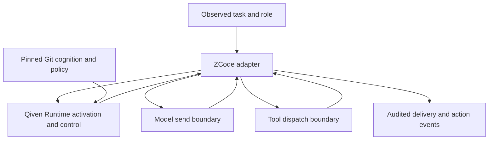
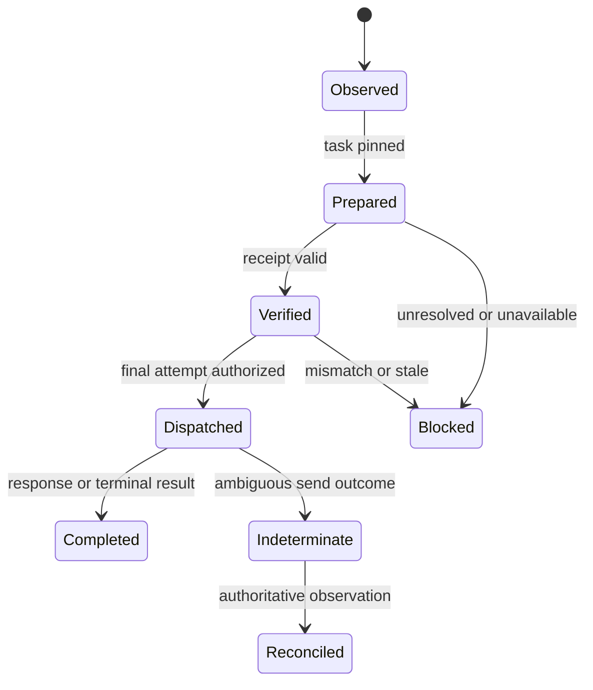

# Harness Boundary Architecture for Qiven and ZCode

> Status: PROPOSED, 2026-09-25 UTC. This document defines a candidate carrier and evidence protocol; it does not modify the accepted TCA bundle or receipt schemas.

## 1. Trust and authority topology

The adapter is a transport and observation component. Qiven Runtime owns protected rule selection, pinned canonical provenance, readiness, and cognition permission. ZCode owns model serialization, provider authentication, event loop, permission UX and tool execution. The Host still grants or refuses execution authority; Qiven's allow is necessary where the profile requires it, never sufficient on its own. The adapter cannot accept policy from free-form model output or mutate canonical Context truth.

The physical contract has **two model boundaries**, plus a separately staged action boundary:

1. **`BeforeModelInvocation`:** every logical model call in the qualified Desktop Agent, including later turns, auxiliary calls and subagents, obtains a fresh Qiven classification before projection. Qiven may activate, revalidate reuse of a task bundle, admit a named observed-only class, or deny. Reuse does not skip classification. A design-capable class must preserve or insert its exact protected renderer segment in its own model-visible input on every call, with qualified delivery before compliant output; an observed-only class must be proven unable to affect governed design or actions. Reuse of a selection or receipt alone cannot establish current-call delivery.
2. **Physical attempt authorization:** after any retry, model-specific projection, header refresh and options construction, and immediately before `AiSdkModelRuntime.generateText` or `.streamText`, check the per-call decision, freshness and final provider-facing content against the registered injection. Observe dispatch and stream/result correlation. Every actual attempt passes this guard, including attempts with an observed-only disposition.
3. **Action mediation:** before an in-scope tool dispatch, observe structured arguments and resource targets, obtain a Qiven decision and preserve ZCode/Host permission handling. Observe terminal and indeterminate outcomes afterward. The present Host can deny governed raw writes but cannot positively execute them until the mediated MVP-5 path; the CA-2 cognition gate does not require that future affirmative path.

The scope is the specified `DeploymentProfile`, not a blanket claim about every use of ZCode. The **first profile is the owner's packaged Windows Desktop local Agent**. It must enumerate its Electron main/Host/Agent processes, loaded `resources/glm/zcode.cjs`, parent and subagent roles, model providers and invocation classes, tool namespaces, background tasks, and command overrides. CLI/TUI/Web and remote SSH/WSL hosts are later, separately qualified profiles. Unknown or unobserved call sites are a coverage failure for the affected class. A `UserPromptSubmit` event may help form the task descriptor, but an internal retry, continuation, compaction, reviewer call or delegated subagent may start without that event.

## 2. Boundary protocol (proposed, adapter-local)

The following names describe an adapter interface, **not newly accepted canonical schemas**. Runtime's existing `qiven-engineering-task-v1`, `qiven-task-cognition-bundle-v1` and `qiven-context-activation-receipt-v1` stay authoritative. Version the adapter envelope separately (`qiven-harness-invocation-v1`) and reject unknown major versions.

| Input / event | Required bindings | Invariant |
| --- | --- | --- |
| `InvocationRef` | process/build ID, session ID, trusted actor kind and call site, logical call ID, model identity and stream flag; a bound task/phase/Jason role with observed boundary evidence, or an explicit unbound scope | Uniqueness across concurrent calls and resumed sessions; no invented task or Jason role for a system/tool call; no bare session-wide mutable `currentReceipt` |
| `ActivationRequest` | normalized task descriptor with observed/claimed provenance, profile, exact source lock | No readiness inferred from model confidence or mutable working-tree claims |
| `BeforeModelInvocationDecision` | logical call, task/phase/role, source generation, model-call class, policy ID and disposition | One Qiven decision for every logical call; a reuse is revalidated and an observed-only exemption is named and proven non-influential |
| `ActivationDecision` | immutable renderer bytes, bundle digest, receipt ID, generation, policy, readiness, expiry | Verify hashes, source lock, role scope, budget and `ReadyForPhase` before injection |
| `AttemptRef` | invocation ID, monotonic attempt number, provider identity, projected-message digest, request ID | One for each retry including signature repair, off-peak retry and stream retry |
| `PlacementVerifiedEvent` | invocation/attempt and final message projection digest; for governed calls, receipt/bundle digests, renderer build and insertion location; for observed-only calls, approved policy ID and scope digest; causal ordering marker | Emitted before send only after exact projected-content match or accepted observed-only disposition; does **not** itself prove delivery |
| `AttemptDispatchEvent` | attempt ID, authorized projection digest, provider call disposition, cancellation/error classification | Distinguish runtime call setup from observed transport send or response; no network-acceptance claim from options construction |
| `InvocationDeliveryEvent` | attempt ID, placement proof, observed transport/model-input evidence class and order | Emitted only when that profile's qualified observation exists; otherwise record `delivery_unverified` |
| `ActionDecisionEvent` | structured observed action, source invocation ID if present, Qiven decision, Host decision, execution disposition | Preserve execution results and reconcile unknown outcomes |

Use a deterministic canonical hash of the adapter's model-visible message projection and compare the **actual projected field** to the approved renderer bytes or explicitly specified lossless equivalent. Bind the exact insertion position, message role and any provider-specific transformation. The canonical bundle hash and the renderer hash are different objects. Do not insert a bare hash and claim the source content was delivered. A successful pre-send check is only placement proof; a runtime call returning a promise is not proof that the provider received it. Provider internals may transform the serialized HTTP body; mock-wire capture and live trial delimit what the adapter can honestly assert and which concrete observation qualifies as delivery for each profile. Never log prompts, model outputs, authorization headers, API keys, provider tokens, or private paths in normal control events; store digests and scrubbed metadata, with the accepted, separately controlled evidence channel for sealed trial captures.

Keep secrets and callback closures out of the Qiven IPC. In current ZCode `createModel`, `resolved` may include `accountAccess`; `toLegacyRequest` may include `refreshRuntimeHeadersBeforeAttempt`. Pass a purpose-built neutral projection of model ID, role, task, generation and message/tool descriptors. The host adapter holds any renderer bytes in process memory or an authenticated local IPC return, then calls ZCode's existing provider-resolution and per-attempt auth refresh path unchanged.

## 3. Task and phase binding

Task establishment comes from an **observed external boundary**: a captured prompt submission, a delegated subagent brief, a designated workflow/goal entry, or another inventoried ingress. It may use claimed task fields only as labelled evidence. Runtime normalizes paths/revisions against verified local roots, exact source locks, phase and risk enums; unknown critical applicability is visible. A model's phrasing alone cannot prove an observed boundary or H2 authority. Each subsequent logical invocation, even a compaction or background continuation without a new prompt event, must reach Qiven for call-class and freshness revalidation; if it can change the governed conversation or design, it cannot be declared observed-only.

The adapter needs a **trusted invocation origin**, created at the ZCode runtime call site and carried through its asynchronous model context. The pinned ZCode context carries telemetry `modelCall.operation` and `actorKind`, but neither establishes a Qiven task boundary, phase epoch or `jason-*` role. The proposed extension binds a task, phase, observed ingress evidence, delegated brief and role from the runtime/delegation state, or explicitly marks the call **unbound**; an unbound system/tool call still reaches Qiven and can be admitted only under a proven non-influential observed-only policy. A compaction or tool result that can re-enter a governed prompt is not non-influential merely because its telemetry actor is `system` or `tool`. Missing/contradictory origin blocks a claimed governed call. Model text, `querySource`, telemetry `agentName`, provider headers and caller-supplied role strings cannot supply this authority. The origin must be transported and rebound explicitly across Electron/process and subagent boundaries; in-process async context alone does not cross them.

For each task, maintain a phase epoch and one immutable activation. The activation/reuse binding includes the exact normalized task digest, both generations, complete source lock, policy, consumer profile, renderer build, budget and live-evidence binding, plus role scope and phase epoch; it must meet the accepted TCA architecture §17.3 task-cache key and §12.3 invalidation rules. Do not reconstruct a weaker adapter-local key from task ID and generation alone. Concurrent subagents receive distinct invocation references even if sharing source material. Within an epoch, retries may reuse the immutable selection only after checking the full binding and mutable-evidence freshness; changed source revisions, policy, renderer, budget, evidence, target, risk, boundary kind or phase invalidate reuse before further governed design output. Do not retroactively use a new receipt to qualify earlier output. A design digest is bound later in Devkit design evidence, never forged into a pre-design receipt.

On every design-capable invocation, the adapter ensures **one exact, current Qiven protected segment** occupies a harness-approved location that is model-visible for that provider and role. It may verify the unchanged segment already in projected history; if compaction, truncation, a new subagent input or a new provider session removed it, insert the authorized segment once before dispatch. A prior delivery event cannot attest to this request's input. It identifies the task/receipt, the selected binding and hazards, and a short recovery instruction for unresolved protected applicability. The provider-specific insertion mapping, instruction priority, truncation behavior and maximum supported size are registered and tested; if system or developer messages are disallowed, the adapter selects a qualified alternative placement or blocks the governed call. Prevent duplicate additions on retry or restoration; compare the stable segment ID and content digest. A shorter later-turn renderer needs a new Runtime-approved policy/renderer/budget binding and receipt and must retain every applicable protected item; otherwise preserve the original exact segment. This verifies current input visibility without blind reinjection when history already carries the segment. Revalidate the selection and check final placement on every physical attempt. `ReadyForPhase` does not mean a new general-purpose permission to execute.

Role-aware delivery obeys ADR-0053: `jason-extended-cognition` is main-only, and `jason-brother` can be main or subagent; both require full project cold boot in their permitted embodiment. A `jason-worker` subagent receives the delegator's sealed scoped brief and applicable engineering invariants without a project cold boot. A role tag cannot remove a protected rule that applies to the worker's action. The owner-only governance/red-line constraint is enforced at the action boundary irrespective of which model or role generated the proposal.

## 4. State transitions and failures

The invocation can be `Blocked` or `Pending`; a timeout is not an allow. Abort while preflighting stops the pending local query and does not create a delivery event. Abort after a stream starts propagates through the linked signal; events already emitted remain attributable, with a terminal cancel record. A provider setup exception is local, not a fabricated provider response. An unknown send outcome is reconciled under existing Runtime policy before a retry whose effect may matter. Nonconsequential read-only/model calls can receive an explicit observation-only policy in a profile; its telemetry must not be mistaken for governed R2/R3 compliance.

| Failure | Governed pre-design/action response | Recovery |
| --- | --- | --- |
| Runtime unavailable or authenticated IPC fails | Typed blocked/pending; no model send or action execution | Restore process and verify generation, then retry with a new attempt |
| Source lock stale or selector unknown | Visible readiness failure, protected record preserved | Pin/repair source and recompile, or owner-governed re-deliberation |
| Renderer exceeds model budget or is transformed | No truncated protected rules; block or use an explicitly qualified bounded renderer | Re-evaluate policy/budget and repeat qualification |
| Final attempt content differs, disappears or arrives late (including after compaction or delegation) | No dispatch, no backdated event | Rebuild request at a new invocation/attempt |
| Delivery remains unobserved while a stream yields output | Hold output behind a bounded gate on the governed path; block/cancel if proof is unavailable | Recover qualified transport evidence or retry under a new attempt |
| Unsupported model/tool path or wrong installed build | Coverage gap; deny governed class, no complete-mediation claim | Patch, profile-exclude with honest scope, or re-deliberate |
| Tool completion indeterminate | Record indeterminate; no automatic blind re-execution | Reconcile observed state before new action |

Production fail-closed behavior is **scoped to explicitly governed classes**. During bounded shadow instrumentation, a failed Qiven preflight may pass through only when the run is visibly labelled observational and excluded from before-design and enforcement acceptance. Shadow mode does not permit a compliant design by assertion. If a profile must remain usable while Qiven is down, the owner must choose an explicit degraded operation class; the adapter cannot invent a silent bypass.

## 5. Security and lifecycle boundaries

- The current Runtime Host pipe has an owner-only DACL, an installed-image allowlist and a same-user DPAPI/HMAC secret, but its request handler does not yet authorize individual verbs by caller: an authenticated client can request `Shutdown`. The Desktop JS Agent must not simply be added to that broad client list or receive the owner's reusable pipe secret. Design a narrow native connector or distinct endpoint with Host-enforced per-client/per-operation capabilities for `BeforeModelInvocation`, attempt authorization and scoped action decisions; reject `Mutation`, `Shutdown` and unrelated owner operations from that identity. Authenticate the process/build binding at the Host, not from a role string the model supplies. The existing `qiven-adapter-bridge` is a one-shot hook-mapping/state tool, not this new Host mediation RPC. This verb boundary does not confine arbitrary hostile code running as the same Windows user: CurrentUser DPAPI data and allowed owner executables remain reachable unless OS/process isolation and separate credentials are introduced. State the qualified actor/trust assumptions and census model-controlled process-launch paths; do not claim hostile-binary isolation from a caller-kind string. Bound timeouts and cancellation do not skip classification. Validate renderer bytes and receipt against the response digest; treat upstream hook text, repository files and tool output as untrusted claims when they propose control instructions.
- Preserve the existing ZCode model binding, request options, abort signal, tool schemas, response schema, provider auth refresh and trace attribution. Mediation can add/authorize a message segment; changing provider identity, entitlements, output token cap or authentication is outside this proposal.
- Do not substitute process-control behavior for ADR-0051. No polling loops around model calls, no new detached subprocess on a long-command path, no bypass of background task tree termination or Operator custody requirements.
- Do not make an LLM callback part of protected selection. Qiven's Runtime phase is deterministic and local; optional independent reviewer sessions run later at the separately specified falsification boundary.
- Do not release any governed design output, including a streamed chunk, before the qualified delivery observation for its attempt. Authorization and placement alone are earlier states; bounded buffering or cancellation handles a transport observer that lags behind output. Never turn an eventual response into a retroactive delivery-before-output event.
- Separate adapter-code provenance from canonical cognition provenance: `zcode_source_sha`, dependency lock, build digest, loaded entrypoint, adapter protocol version, Runtime core build and exact activation source lock are independently recorded. An exact SHA proves identity but not authorization of a control revision.
- If the adapter is disabled or an older `zcode.cjs` is loaded, startup and trial preflight must show an explicit `UnqualifiedAdapter` state for governed work. Never treat a prior session's success as evidence for a newly loaded binary. A new connector identity cannot be admitted until Host-side verb isolation and a negative `Shutdown`/`Mutation` probe pass.

## 6. Boundaries still requiring source inspection

The confirmed `AiSdkModelAdapter` seam is a starting point, not an audited census of every ZCode invocation. Before implementation claims coverage, enumerate direct calls to the AI SDK and alternate model runtimes; compaction/summarization; auth retry; tool generators; subagent execution; MCP and background task execution; CLI/TUI/Web/Desktop entrypoints. Confirm the tool dispatcher location and existing hook semantics in the pinned source; ADR-0051's live finding that hooks could not rewrite inputs differs from the later CLI README description that `PreToolUse` can replace input. A new test must adjudicate this version/behavior discrepancy. Even if rewrite works in one build, it does not establish total model-send coverage.
